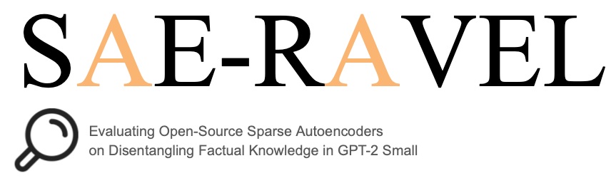
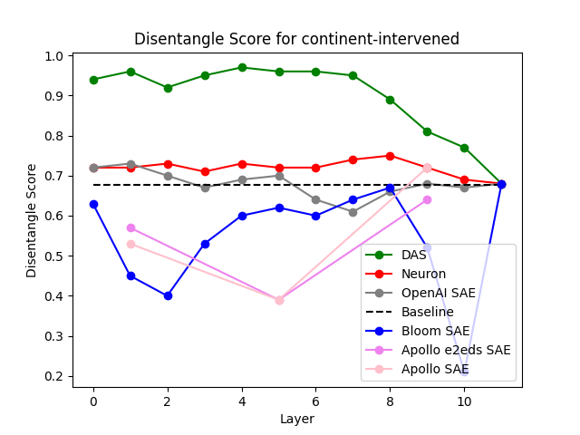
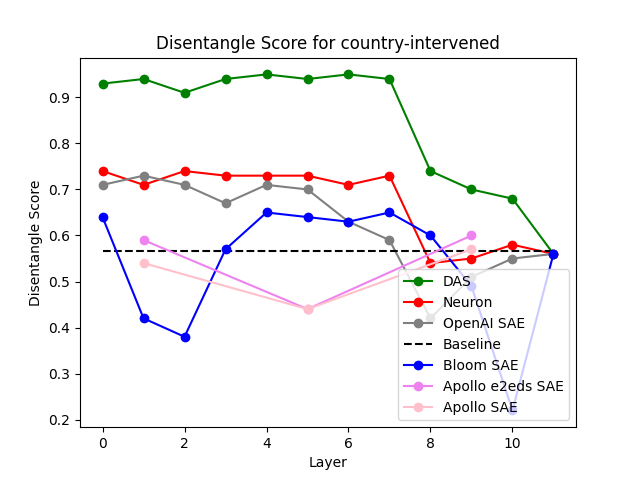

# Official Repository for "Evaluating Open-Source Sparse Autoencoders on Disentangling Factual Knowledge in GPT-2 Small"


by [Maheep Chaudhary](https://maheepchaudhary.github.io) and [Atticus Geiger](https://atticusg.github.io).

Access our paper on [ArXiv]().

## 📑 Table of Contents

- [🔍 About](#about)
- [📊 Result](#result)
- [⚙️ Setup](#setup)
- [🏋️ Training](#training)
- [📈 Evaluation](#evaluation)
- [📚 Citation](#citation)

## 🔍 About

We evaluate different open-source Sparse Autoencoders for GPT-2 small by different organisations, specifically by [OpenAI](https://github.com/openai/sparse_autoencoder), [Apollo Research](https://github.com/ApolloResearch/e2e_sae), and [Joseph Bloom](https://huggingface.co/jbloom/GPT2-Small-SAEs-Reformatted) on the [RAVEL](https://github.com/explanare/ravel) dataset.
We compare them against neurons and [DAS](https://arxiv.org/abs/2303.02536) based on how much they are able to disentangle the concept in neurons or latent space.

## 📊 Result

The below graphs show the performance:

<p align="center">
  
  
</p>

## ⚙️ Setup

To download different SAEs and set up the environment, one can run:

```
chmod +x setup.sh run.sh eval_run.sh
./setup.sh
```

We ran the evaluation for 6 SAEs for the SAE for the Apollo research could be download just by changing id of wandb inside the [code](https://github.com/MaheepChaudhary/SAE-Ravel/blob/6da0beea4129a58af4af491dbd429cf0d1d95af6/models.py#L219). These are the following ids of 6 SAEs:

* Layer 1 e2e SAE: *bst0prdd*
* Layer 1 e2e+ds SAE: *e26jflpq*
* Layer 5 e2e SAE: *tvj2owza* 
* Layer 5 e2e+ds SAE: *2lzle2f0*
* Layer 9 e2e SAE: *vnfh4vpi*
* Layer 9 e2e+ds SAE: *u50mksr8* 

## 🏋️ Training

For training the mask for models or DAS, one can run the command:

```
./run.sh
```

## 📈 Evaluation

The evaluation of SAE for their quality in terms of loss and accuracy can be executed using the command:

```
./eval_run.sh
```

## 📚 Citation
If you find this repository useful in your research, please consider citing our paper:


```
@misc{chaudhary2024evaluatingopensourcesparseautoencodersongpt2small,
      title={Evaluating Open-Source Sparse Autoencoders on Disentangling Factual Knowledge in GPT-2 Small}, 
      author={Maheep Chaudhary and Atticus Geiger},
      year={2024},
      eprint={},
      archivePrefix={arXiv},
      primaryClass={cs.AI},
      url={}, 
}
```